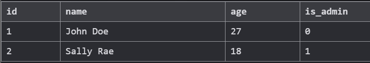
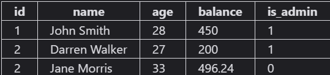
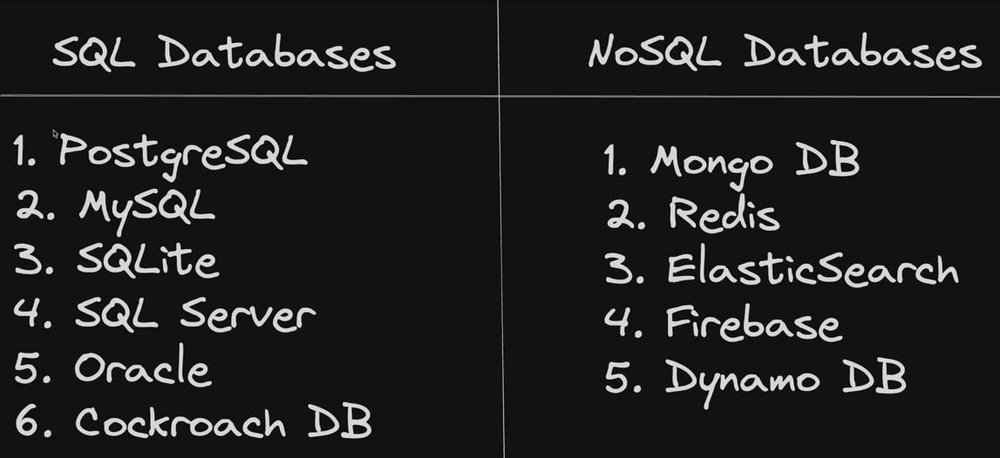
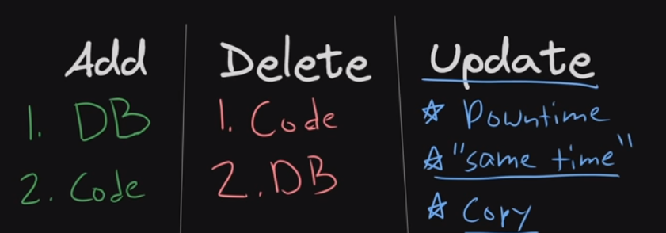
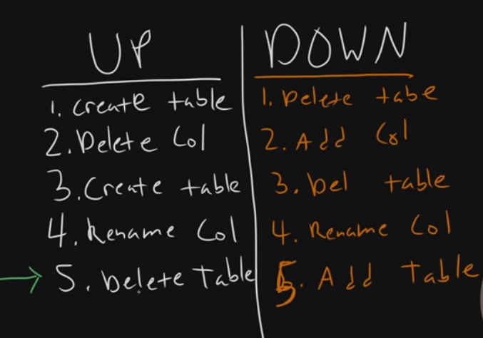

# Introdução ao SQL 

Um banco de dados é apenas um software/ferramenta usada para armazenar uma grande quantidade de dados.

```sql 
SELECT * FROM users;
``` 

O comando acima é usado para selecionar a tabela users.



A operação `SELECT` no sql é uma das mais comuns pois é um comando usado para a leitura de dados, um exemplo possível é acessar os dados da coluna `id` pertencente a tabela usuario 

```sql 
SELECT id from users;
```

"Obs: O SQL não diferencia letra maiuscula de minuscula."

É possível também fazer uma requisição de mais de um retorno a uma tabela sql da mesma forma feita anteriormente dividindo as colunas por virgula `,`.

```sql

SELECT id, name FROM users; 

```

E por fim podemos recuperar todas as tabelas de uma vez usano o `*`.

```sql

SELECT * FROM users;

```

#### EXEMPLO

Uma empresa possui uma tabela com varias informações, o RH solicita que sejam encontrados os dados dos usuarios que são eles `name` e `balance`, use a linguagem sql para automatizar a buscar.



**RESOLUÇÂO**

Podemos usar o seguinte comando `SELECT` para ter a leitura da tabela users

```sql

SELECT name, balance FROM users;

```

## SQL VS NoSQL 



O primeiro ponto a ser debatido é que bancos de dados baseados em SQL tendem a ser muito parecidos, já para o NoSQL essas diferenças são gritantes chegando a serem parecidos apenas por usar SQL. Sendo assim os bancos de dados SQL são considerados `general purpose` pois podem ser usados por diversas linguagens diferentes. Já bancos de dados baseados em NoSQL tendem a ser mais expecificos.  


#### Criando uma tabela 

`CREATE TABLE users (id INTEGER, name TEXT, age INTEGER);` é usado para criar uma tabela, com 3 entradas, logo após já inserir os usuarios.

```sql

CREATE TABLE users (id INTEGER, name TEXT, age INTEGER);
INSERT into users (id, name, age) values (1, 'John Doe', 21);
INSERT into users (id, name, age) values (2, 'Montgomery Burns', 33);
SELECT * FROM users;


```

O primeiro passo para criar uma tabela é usar o comando `CREATE TABLE` junto do nome ao qual a tabela irá receber, depois expecificamos as colunas que irão compor a tabela.

```sql 

CREATE TABLE funcionarios (id INTEGER, name TEXT, idade INTEGER, is_manager BOOLEAN, salario FLOAT);

```

Além disso pode ser identada da seguinte forma. 

```sql 

CREATE TABLE employees(
    id INTEGER,
    name TEXT,
    idade INTEGER,
    is_manager BOOLEAN,
    salario FLOAT
);

```

#### EXEMPLO 

Crie uma tabela para uma empresa na qual possa ser inseridos pessoas:

```sql

CREATE TABLE people (
  id INTEGER,
  handle TEXT,
  name TEXT,
  age INTEGER,
  balance INTEGER,
  is_admin BOOLEAN
);

```
Um ponto importante sobre table é que alterar uma tabela em uso pode não ser uma boa pratica pois pode acarretar em oscilações e bugs dentro do BD.

##### Renomeando uma tabela

```sql 
ALTER TABLE employees
RENAME TO contractors;
```

##### Renomeando uma coluna

```sql
ALTER TABLE contractors
RENAME COLUMN salary TO invoice;
```

##### Adicionar ou Remover uma coluna

```sql
ALTER TABLE contractors
ADD COLUMN job_title TEXT;
```

```sql
ALTER TABLE contractors
DROP COLUMN is_manager;
```

#### Exemplo 

Usando as informações vista até então faça as seguintes alterações na tabela people:

    1 - Renomear a tabela para users
    2 - Altere a coluna user para username
    3 - Crie uma nova coluna para receber as senhas dos usuarios(TEXT)

#### RESOLUÇÂO

```sql

ALTER TABLE people RENAME TO users;
ALTER TABLE users RENAME COLUMN HANDLE TO username;
ALTER TABLE users ADD COLUMN password TEXT;

```

O ato de criar uma nova tabela, ou uma nova coluna que até então não existia na tabela é chamado de `migração`, o que não é perigoso no sentido de perda de dados pois esta sendo criado uma tabela para receber novas informações, agora por exemplo se antes era usada a autenticação usando uma ``password` essa que foi retira pois a aplicação não necessita mais pelo fato da autenticação com a conta google, o ato de remover essa coluna é algo estritamente perigoso para o banco de dados.



Migrações tem uma ordem natural a serem feita, por exemplo renomear uma coluna é algo natural, porém renomear uma tabela não é algo tão simples dito isso podemos dividir as mesmas em duas tabelas para simplificar as explicações.



O SQLlite não se importa muito com os tipos de dados logo dependendo de como estiver sendo armazenado o tipo de dado pode ocorrer inconsistencias nas inserções de novos dados para as tabelas.

O SQL suporta varios tipos de dados, dentre eles: 
  1 - ``` NULL``` - Null value
  2 - ``` INTEGER ``` - Um valor inteiro que pode ser salvo em até 8 bits.
  3 - ``` REAL``` - Um numero salvo em ponto flutuante que pode ter até 64 bits.
  4 - ``` TEXT ``` - Uma string que pode ser salva como UTF-8.
  5 - ``` BLOB ``` - Abreviação de objeto binário grande e normalmente usado para imagens, áudio ou outros multimídia.
  6 - ``` BOLEAN ``` - São valores associados a verdadeiro ou falso, porém recebem no banco apenas 0 ou 1.


EX: 
Escreva uma atualização na Table posts:

  1 - A coluna ```author_id``` deve ser renomeada para ```poster_id``` 

  2 - Adicione uma nova coluna chamada ```is_edited``` com um tipo ```BOOLEAN```

  3 - Remova a coluna ```is_sponsored```


### Resolução

```
ALTER TABLE posts RENAME COLUMN author_id TO poster_id;
ALTER TABLE posts ADD COLUMN is_edited BOOLEAN; 
ALTER TABLE posts DROP COLUMN is_sponsored;
```

  ## Constrains 
